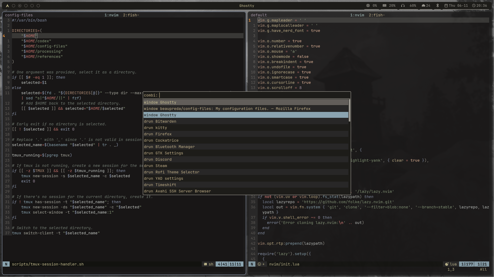

# Configuration Files
This repository contains all the configuration files for the different programs that I use. I try to go for simple and minimal configurations, staying close to the defaults as much as possible. The theme is [Kanagawa Dragon](https://github.com/rebelot/kanagawa.nvim). This is not meant to be a setup that can be easily installed (maybe one day!), so feel free to take small bits if you like parts of it!

## Programs
- [dunst](https://github.com/dunst-project/dunst)
- [fish](https://github.com/fish-shell/fish-shell)
- [ghostty](https://github.com/ghostty-org/ghostty)
- [Hyprland](https://github.com/hyprwm/Hyprland)
- [kitty](https://github.com/kovidgoyal/kitty)
- [Neovim](https://github.com/neovim/neovim)
- [rofi](https://github.com/davatorium/rofi)
- [starship](https://github.com/starship/starship)
- [tmux](https://github.com/tmux/tmux)
- [waybar](https://github.com/Alexays/Waybar)

## Other Useful Tools
- [fzf](https://github.com/junegunn/fzf)
- [lazygit](https://github.com/jesseduffield/lazygit)
- [fd](https://github.com/sharkdp/fd)
- [ripgrep](https://github.com/BurntSushi/ripgrep)
- [bat](https://github.com/sharkdp/bat)
